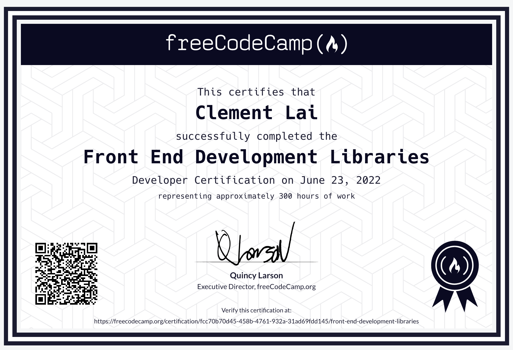

Certainly! Here's a README template for the Front End Development Libraries Certification with the mentioned projects:

```markdown
# Front End Development Libraries

FreeCodeCamp Front End Development Libraries Certification, showcasing skills in using front-end development libraries. Explore projects, each passing automated test suites. Demonstrates a commitment to building interactive and dynamic user interfaces.

## Projects

### 1. Random Quote Machine
- **Description:** Create a web app that generates random quotes.
- **Link:** [Random Quote Machine](https://codepen.io/mrwednesday33/full/XWZLONE)

### 2. Markdown Previewer
- **Description:** Build a markdown editor with a live preview feature.
- **Link:** [Markdown Previewer](https://codepen.io/mrwednesday33/full/ExQJzbz)

### 3. Drum Machine
- **Description:** Design a virtual drum machine with interactive features.
- **Link:** [Drum Machine](https://codepen.io/mrwednesday33/pen/MWQxEwz)

### 4. JavaScript Calculator
- **Description:** Create a calculator with basic arithmetic functions.
- **Link:** [JavaScript Calculator](https://codepen.io/mrwednesday33/full/VwQJgaR)

### 5. 25 + 5 Clock
- **Description:** Build a timer with adjustable session and break lengths.
- **Link:** [25 + 5 Clock](https://codepen.io/mrwednesday33/pen/dydaQRj)

## Certification

